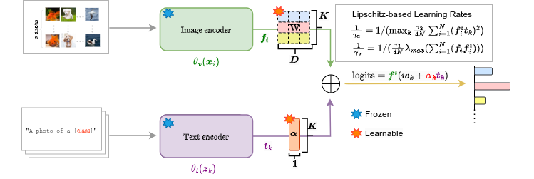

# CVPR 2024 paper: LP++: A Surprisingly Strong Linear Probe for Few-Shot CLIP

## Introduction

LP++  is a simple generalization of the standard linear-probe classifier, which integrates text knowledge: We express the linear classifier weights as learnable functions of the text embeddings, with class-wise multipliers blending image and text features. Surprisingly, LP++ outperforms the recent, strongly emergent and quite convoluted literature on few-shot CLIP adaptation (e.g., popular prompt-learning methods such as CoOp), while running orders-of-magnitudes faster, operating in a black-box setting and removing intensive validation searches for the optimization hyper-parameters. [[Paper](https://arxiv.org/abs/2404.02285)]

 <br/>
## Requirements


### Installation
Create a conda environment and install dependencies:
```bash

conda create -n linear_probe_p2 python=3.7
conda activate linear_probe_p2

pip install -r requirements.txt

# Install the according versions of torch and torchvision
conda install pytorch torchvision cudatoolkit
```

### Dataset
Follow [DATASET.md](https://github.com/gaopengcuhk/Tip-Adapter/blob/main/DATASET.md) to install ImageNet and other 10 datasets referring to CoOp.

## Get Started
### Configs
Specify basic configuration as (num_shots, num_tasks, method, etc) and hyperparameters in `configs/base.yaml`. 

### Experiments

For ImageNet dataset:
```bash
python main_imagenet.py --base_config configs/base.yaml --dataset_config configs/imagenet.yaml
```

For Other datasets:

```bash
python main.py --base_config configs/base.yaml --dataset_config configs/{dataset_name}.yaml
```

Example of running LP++ on caltech dataset in 16 shot setting:
```bash
python main.py --base_config configs/base.yaml --dataset_config configs/{dataset_name}.yaml --opt root_path {DATA_PATH} output_dir {OUTPUT_PATH} method LinearProbe_P2 shots 16 tasks 10
```


[This repo is built on top of [TipAdapter](https://github.com/gaopengcuhk/Tip-Adapter).]

# Citation

If you find this repository useful, please consider citing this paper:
```
@inproceedings{lp24,
    title={LP++: A Surprisingly Strong Linear Probe for Few-Shot CLIP},
    author={Yunshi Huang and Fereshteh Shakeri and Jose Dolz and Malik Boudiaf and Houda Bahig and Ismail Ben Ayed},
    booktitle={IEEE/CVF Conference on Computer Vision and Pattern Recognition (CVPR)},
    year={2024}
    }